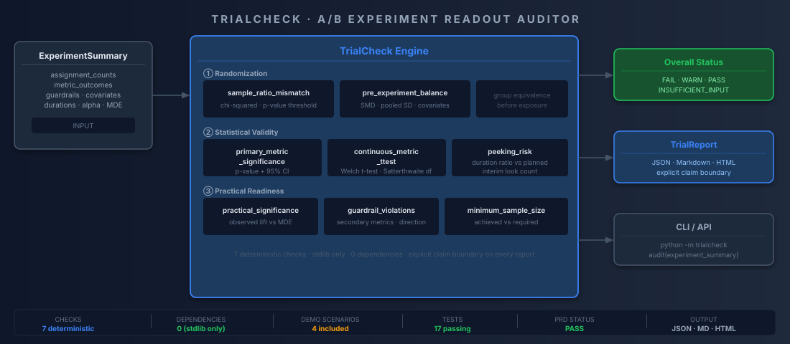
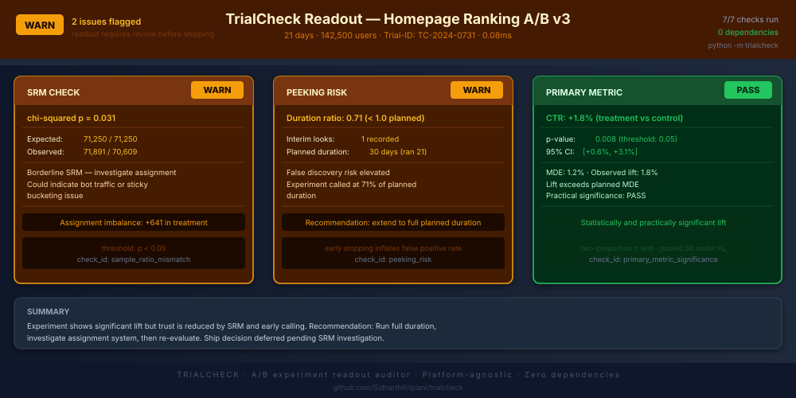

# TrialCheck

> Platform-agnostic A/B experiment readout auditor. Catches SRM, peeking violations, underpowered tests, and guardrail regressions before you ship a wrong decision.

<p>
  
  
  
  
</p>

<p>
  
  
  
  
</p>

TrialCheck audits completed A/B experiment readouts and returns a structured PASS / WARN / FAIL report. It does not run experiments — it checks whether a finished one is trustworthy enough to act on.

## Architecture



---

## Sample Output



---

## The Problem

The problem is not that teams don't know what to check before shipping an experiment. Senior data scientists have a consistent mental checklist: Did assignment work? Was this called early? Is the lift real and large enough to matter? Did any guardrail move in the wrong direction? Were groups balanced before the test started?

The problem is that this checklist lives in runbooks, reviewer notes, and institutional memory — applied inconsistently, skipped under deadline pressure, and invisible to junior practitioners who haven't learned it yet. A fast-moving team will ship on a p-value alone. A careful one catches the SRM at review, the peeking three weeks later, and the guardrail regression only in production.

TrialCheck packages that senior DS checklist into a library call. Feed it an experiment summary — assignment counts, metric outcomes, optional guardrails and pre-period data — and it runs every check at once, returns a structured per-check verdict, and surfaces the risks that would otherwise depend on who happens to be in the review meeting.

This is decision support, not a decision-maker. TrialCheck tells you what the data says about readout quality. The ship/no-ship call is still yours.

## The 7 checks

| # | Check | Group | Method | Fires when |
|---|---|---|---|---|
| 1 | SRM | Randomization | chi² df=1, exact p via erfc | Observed split deviates from planned ratio |
| 2 | Pre-period balance | Randomization | SMD per covariate, pooled SD | Any covariate SMD ≥ 0.1 before treatment |
| 3 | Primary metric | Statistical | Two-proportion z-test, pooled SE | p > alpha or missing assignment counts |
| 4 | Continuous metric | Statistical | Welch t-test, Welch–Satterthwaite df | p > alpha for mean comparison |
| 5 | Peeking risk | Statistical | Duration ratio + interim look count | Test called before planned duration |
| 6 | Practical significance | Practical | Observed lift vs business threshold | Lift is statistically real but practically negligible |
| 7 | Guardrail movement | Practical | Direction check + tolerance band | Guardrail moves in bad direction beyond tolerance |

## Claim boundary

TrialCheck is an audit helper. It does **not** run experiments, assign users, replace an experimentation platform, prove causal validity, perform CUPED or sequential testing, correct for multiple comparisons across metrics, or make automatic ship/no-ship decisions.

## Install

```bash
pip install trialcheck
```

## Quickstart

```python
from trialcheck import TrialCheck, write_report
from trialcheck.io import load_experiment_json

experiment = load_experiment_json("sample_data/checkout_experiment_summary.json")
report = TrialCheck(experiment).run()

print(report.overall_status.value)   # FAIL / WARN / PASS
print(report.interpretation)

write_report(report, "outputs/trialcheck_report.json")
write_report(report, "outputs/trialcheck_report.md")
write_report(report, "outputs/trialcheck_report.html")
```

## Run the demo

```bash
git clone https://github.com/SidharthKriplani/trialcheck
cd trialcheck
pip install -e .
python scripts/generate_demo_reports.py
open outputs/trialcheck_report.html
```

## Four canonical scenarios

| Scenario | Status | What fires |
|---|---|---|
| `clean_pass` | PASS | All checks green; full data supplied |
| `srm_fail` | FAIL | 56/44 observed vs 50/50 planned |
| `peeking_warn` | WARN | 36% of planned duration, 2 interim looks |
| `guardrail_harm` | FAIL | Revenue/user −4.4%; refund rate doubles |

## Resume-safe claim

Built **TrialCheck**, a platform-agnostic A/B experiment readout auditor that checks completed experiment summaries for sample-ratio mismatch (chi-square), peeking risk, MDE context, practical and statistical significance (two-proportion z-test and Welch's t-test), guardrail movement, and pre-period covariate imbalance (SMD), producing JSON/Markdown/HTML audit reports with explicit decision caveats. Zero dependencies. 27 tests. 4 canonical demo scenarios.

## Roadmap

- Multiple comparison correction across guardrail metrics (Bonferroni, Holm)
- CUPED / variance reduction pre-processing hook
- CSV batch audit mode for multiple experiments

## Interview Defense

[📄 TrialCheck_Interview_Defense_v2.pdf](docs/defense/TrialCheck_Interview_Defense_v2.pdf) — covers SRM chi-square derivation, peeking risk model, MDE power analysis, two-proportion z-test and Welch's t-test mechanics, guardrail movement thresholds, and SMD covariate imbalance methodology.

## License

MIT

---

## How This Connects

TrialCheck is the **experiment validity gate** for the decision platforms in this portfolio:

- **PulseRank:** Before accepting any A/B simulation result (e.g., the HOLD_SIMULATED decision on NDCG −7.9%), TrialCheck validates that the experiment had sufficient power, no SRM, and no multiple comparison inflation. Without this gate, the HOLD decision could be based on an underpowered test.
- **MetaSignal:** MetaSignal produces the experiment outcomes; TrialCheck audits whether those outcomes are trustworthy. MetaSignal's CUPED variance reduction is validated by TrialCheck's power analysis — did CUPED actually bring the required sample size within the available experiment window?
- **RiskFrame:** A/B tests on threshold policy changes (e.g., v1.0 vs. v1.1 approval rate comparison) pass through TrialCheck to confirm the difference is statistically significant before the policy is locked.

TrialCheck is framework-agnostic by design — it accepts any JSON experiment results file conforming to the documented schema.

---

## Part of Applied LLM Systems Portfolio

This project is part of a 13-repo portfolio targeting Applied LLM Systems Engineer, MLOps, and Technical AI PM roles.

**Applied Systems (LangGraph pipelines):**

| Project | Domain | Primary Failure Mode |
|---------|--------|----------------------|
| [LendFlow](https://github.com/SidharthKriplani/lendflow) | Financial underwriting | When to stop or escalate |
| [AgentReliabilityLab](https://github.com/SidharthKriplani/agentreliabilitylab) | Cyber threat triage | When to stop or escalate |
| [NexusSupply](https://github.com/SidharthKriplani/nexussupply) | Supplier risk intelligence | Conflicting signal fusion |

**Platforms & Auditors (domain-agnostic tooling):**

| Project | What It Audits / Builds |
|---------|------------------------|
| [InferenceLens](https://github.com/SidharthKriplani/inferencelens) | Inference cost/quality tradeoffs — Pareto frontier, routing rules |
| [RiskFrame](https://github.com/SidharthKriplani/riskframe_platform) | ML model lifecycle — champion/challenger, drift, fairness |
| [MetaSignal](https://github.com/SidharthKriplani/metasignal_platform) | A/B experiment validity — CUPED, guardrail-first, SRM |
| [DevPulse](https://github.com/SidharthKriplani/devpulse_platform) | Version-safe RAG — conflict detection, LLM-Last architecture |
| [PulseRank](https://github.com/SidharthKriplani/pulserank_platform) | Marketplace ranking — IPS debiasing, MMR diversity |
| **TrialCheck** | A/B readout audit — SRM, peeking, underpowered tests |
| [FeatureLeakageLens](https://github.com/SidharthKriplani/featureleakagelens_v0) | Pre-training leakage — target, temporal, overlap |
| [GoldenSetAuditor](https://github.com/SidharthKriplani/goldensetauditor_v0) | LLM/RAG eval dataset quality |
| [DocIngestQA](https://github.com/SidharthKriplani/docingestqa) | RAG document ingestion quality — 11 deterministic checks |
| [MetricLens](https://github.com/SidharthKriplani/metriclens) | Metric movement decomposition — mix shift vs rate shift |
