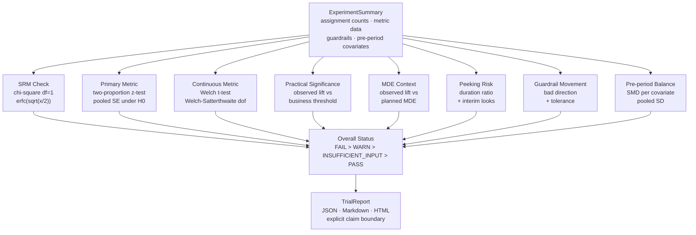

# TrialCheck

**Platform-agnostic A/B experiment readout auditor.**

<p>
  
  
  
  
</p>

<p>
  
  
  
  
</p>

TrialCheck does not run experiments. It audits completed readouts from any experimentation platform, spreadsheet, or warehouse export and returns a structured PASS / WARN / FAIL report.

## About

Most experimentation platforms surface a p-value and a lift estimate. That is not enough information to make a trustworthy ship decision.

Before shipping an experiment result, a senior data scientist checks a consistent set of questions: Did assignment work correctly? Was the result called early? Is the effect large enough to matter in practice? Did any guardrail metrics move harmfully? Were the variants balanced before the test started? These checks are well-understood, but they are rarely automated — they live in runbooks, reviewer checklists, or institutional memory.

TrialCheck packages those checks into a single library call. It accepts a structured experiment summary (assignment counts, metric data, optional guardrails and pre-period covariates) and returns a per-check PASS / WARN / FAIL / INSUFFICIENT_INPUT report with recommendations. The result is readable by humans and parseable by machines (JSON, Markdown, HTML output).

The intended use case: a data scientist or analytics lead runs TrialCheck at readout time, reviews the report, and makes a better-informed decision. TrialCheck is decision support — not a decision-maker.

## Architecture



## Why this exists

A p-value alone is not enough to ship an experiment. Before acting on a readout, teams should check whether the result is trustworthy and decision-ready:

- Did assignment drift? (**SRM** — chi-square df=1)
- Was the result called early or monitored repeatedly? (**peeking risk**)
- Is the lift large enough to matter? (**practical significance**)
- Is the lift below the planned MDE? (**MDE context**)
- Is the continuous metric difference real? (**Welch's t-test**, no equal-variance assumption)
- Did a guardrail move in the wrong direction? (**guardrail movement**)
- Were variants balanced before the test? (**pre-period covariate balance** — SMD)

TrialCheck packages those checks into one lightweight Python library with zero dependencies.

## Claim boundary

TrialCheck is an audit helper. It does **not**:

- run experiments
- assign users
- replace an experimentation platform
- prove causal validity
- perform CUPED or sequential testing
- make automatic ship/no-ship decisions

It surfaces readout risks so a data scientist, experiment owner, or analytics lead can make a better decision.

## Install locally

```bash
cd trialcheck_v0
python -m pip install -e .
```

## Quickstart

```python
from trialcheck import TrialCheck, write_report
from trialcheck.io import load_experiment_json

experiment = load_experiment_json("sample_data/checkout_experiment_summary.json")
report = TrialCheck(experiment).run()

print(report.overall_status.value)
print(report.interpretation)

write_report(report, "outputs/trialcheck_report.json")
write_report(report, "outputs/trialcheck_report.md")
write_report(report, "outputs/trialcheck_report.html")
```

## Run the demo

```bash
cd trialcheck_v0
set -e
python -m pip install -e .
python scripts/generate_demo_reports.py
open outputs/trialcheck_report.html
```

## Run tests

```bash
cd trialcheck_v0
set -e
python -m unittest discover -s tests -v
```

## Four canonical scenarios

The demo ships four pre-built scenarios that each exercise a different failure mode:

| Scenario | Overall | What fires |
|---|---|---|
| `clean_pass` | PASS | All checks green; full data supplied |
| `srm_fail` | FAIL | 56/44 split observed vs 50/50 planned |
| `peeking_warn` | WARN | 36% of planned duration, 2 interim looks |
| `guardrail_harm` | FAIL | Revenue/user drops 4.4%; refund rate doubles |

Run all four with `python scripts/generate_demo_reports.py`.

## Public resume-safe claim

Built **TrialCheck**, a platform-agnostic A/B experiment readout auditor that checks completed experiment summaries for sample-ratio mismatch (chi-square), peeking risk, MDE context, practical and statistical significance (two-proportion z-test and Welch's t-test), guardrail movement, and pre-period covariate imbalance (SMD), producing JSON/Markdown/HTML audit reports with explicit decision caveats. Zero dependencies. 17 tests. 4 canonical demo scenarios.

## Roadmap

- richer power/MDE utilities
- CSV batch audit mode
- optional report styling polish

## License

MIT
